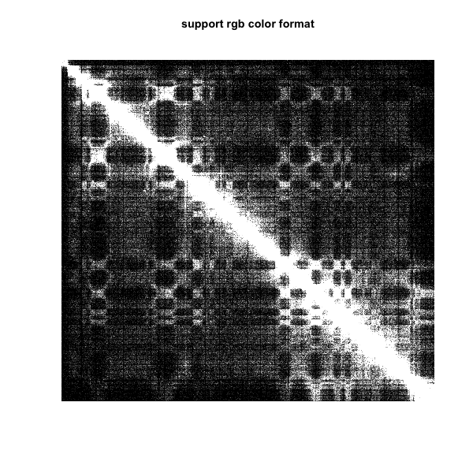
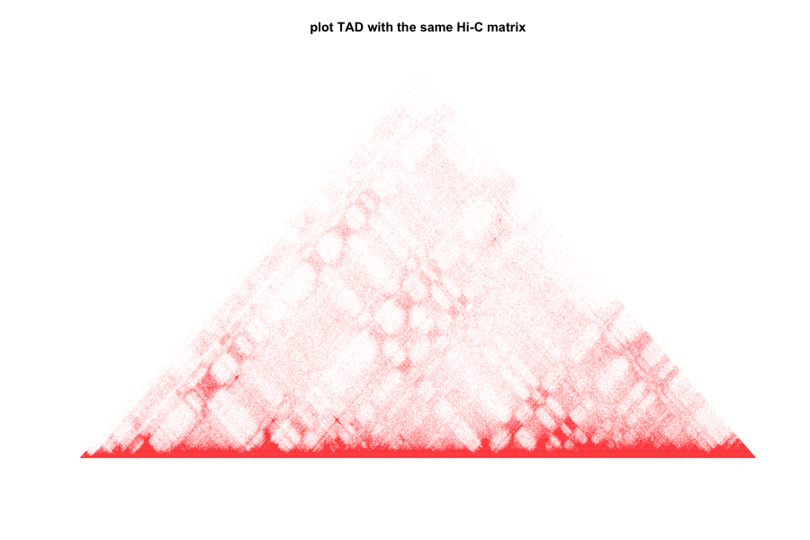
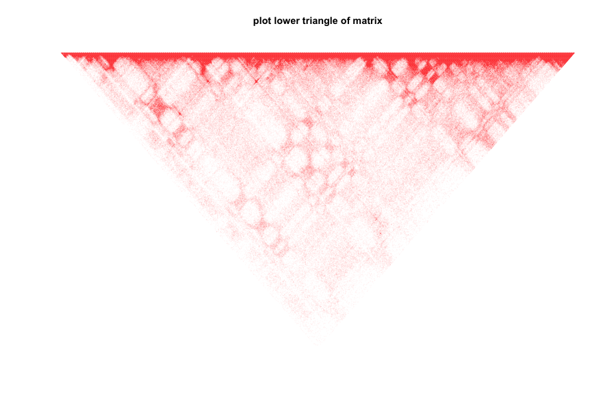

# ngstools
My own tools code for NGS data analysis (Next Generation Sequencing)

Now we have 2 R functions and 1 Python tool:

```
Python tools:
	parse-mpileup.py

R functions:
	plot.TAD
	plot.matrix
```

## How to cite?
When you use code from this repository, please cite like:

```
MENG Haowei, https://github.com/menghaowei/ngstools
```

## R Function: plot.matrix()
please download `ngs_R_function.R`, `./test_data/hic-chr_1_100000.matrix.txt"` and you can use those R functions directly with `source` command in R envirnment like:

```
# load R funtions
source(file = "ngs_R_function.R")

# load test matrix
# This test matrix is from a real Hi-C data set
test_mat = read.table(file = "./test_data/hic-chr_1_100000.matrix.txt",header = F,sep = ",")
```

**1.plot matrix**

```
plot.matrix(test_mat)
title(main="plot heatmap from Hi-C data")
```


**2.plot matrix and filter too large signal (95% quantile number as cutoff)**

```
plot.matrix(test_mat,bound.max = 0.95)
title(main="filter too large signal")
```


**3.set color range from blue to blue**

```
plot.matrix(test_mat,bound.max = 0.95,col.min = "blue",col.max = "blue")
title(main="set heatmap as blue")
```


**4.set color range from blue to red (the bins number less 10 are set as blue)**

```
plot.matrix(test_mat,bound.max = 0.95,col.min = "blue",col.max = "red",col.boundary = 10)
title(main="set color range from blue to red")
```


**5.the function also support RGB color, #000000 means black and #FFFFFF means white**

```
plot.matrix(test_mat,bound.max = 0.95,col.min = "#000000",col.max = "#FFFFFF",col.boundary = 10)
title(main="support rgb color format")

```
 


- - - - - - - - - -
## R Function: plot.TAD()
please download `ngs_R_function.R`, `./test_data/hic-chr_1_100000.matrix.txt"` and you can use those R functions directly with `source` command in R envirnment like:

```
# load R funtions
source(file = "ngs_R_function.R")

# load test matrix
# This test matrix is from a real Hi-C data set
test_mat = read.table(file = "./test_data/hic-chr_1_100000.matrix.txt",header = F,sep = ",")
```
**1.plot upper triangle of matrix (useful for Hi-C TAD plot)**

```
plot.TAD(test_mat,maxBound = 0.95)
title(main="plot TAD with the same Hi-C matrix")
```



**2.plot lower triangle of matrix**

```
plot.TAD(test_mat,maxBound = 0.95,mat.upper = F)
title(main="plot lower triangle of matrix")
```


**3.plot all matrix**

```
plot.TAD(test_mat,maxBound = 0.95,mat.part = F)
title(main="plot whole part of matrix")
```


**4.set color range from blue to red (the bins number less 10 are set as blue)**

```
plot.TAD(test_mat,maxBound = 0.95,col.min = "blue",col.max = "red",col.boundary = 5)
title(main="set color range from blue to red")
```


- - - - - - - - - -

## parse-mpileup.py
parse `samtools mpileup` command output, also known as `.pileup` file, the file like:

```
chr1	10030	c	1	^6.	A
chr1	10031	t	1	.	A
chr1	10032	a	1	.	F
chr1	10033	a	1	.	F
chr1	10034	c	1	.	<
chr1	10035	c	1	.	F
chr1	10036	c	0	*	*
chr1	10037	t	1	.-1A	A
chr1	10038	a	0	*	*
chr1	10039	a	0	*	*
```
The `.pileup` format explain please check the HTML 
[pileup explain](http://samtools.sourceforge.net/pileup.shtml)

And convert `.pileup` file into `.bmat`format, the format like:

```
chr_name	chr_index	ref_base	A	G	C	T	del_count	insert_count	ambiguous_count	deletioninsertion	ambiguous	mut_num
chr1	10030	C	0	0	1	0	0	0	0	.	.	.	0
chr1	10031	T	0	0	0	1	0	0	0	.	.	.	0
chr1	10032	A	1	0	0	0	0	0	0	.	.	.	0
chr1	10033	A	1	0	0	0	0	0	0	.	.	.	0
chr1	10034	C	0	0	1	0	0	0	0	.	.	.	0
chr1	10035	C	0	0	1	0	0	0	0	.	.	.	0
chr1	10036	C	0	0	0	0	1	0	0	*	.	.	0
chr1	10037	T	0	0	0	1	1	0	0	A	.	.	0
chr1	10038	A	0	0	0	0	1	0	0	*	.	.	0
```
For help info, please run `python parse-mpileup.py -h`:

```
python parse-mpileup.py  -h
usage: parse-mpileup.py [-h] -i INPUT [-o OUTPUT] [-p THREADS] [-n MUTNUM]
                        [--TempDir TEMPDIR]

convert mpileup file to info file

optional arguments:
  -h, --help            show this help message and exit
  -i INPUT, --Input INPUT
                        samtools mpileup format file
  -o OUTPUT, --Output OUTPUT
                        Output parsed file
  -p THREADS, --Threads THREADS
                        Multiple threads number, default=1
  -n MUTNUM, --MutNum MUTNUM
                        Only contain mutation info go to the output, set 0
                        mean output all site, default=0
  --TempDir TEMPDIR     Where to keep temp files, default is the same dir with
                        --Input
```
